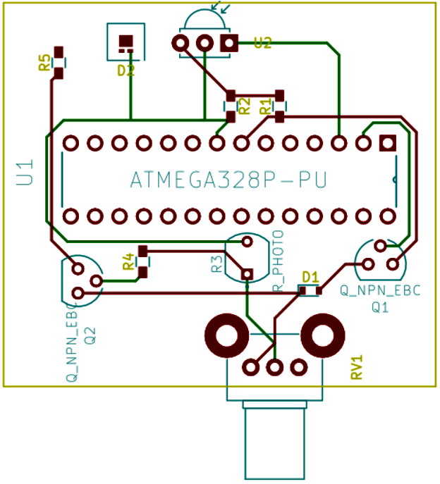

# Spark-Night-Light
PCB for night light

## Intro

The Spark Night Light is an electronic circuit that turns on an LED in dim lighting conditions.

## Demo

Below is a simple demonstration of the LED turning on as all ambient lights in the room are turned off.

